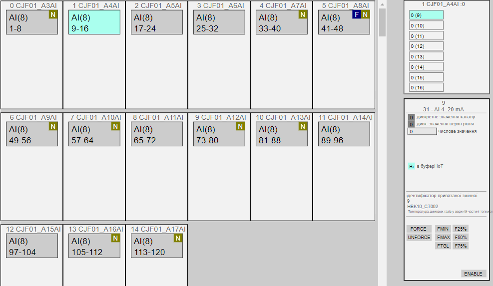

# Класи LVL0 v2

**(CLSID=16#000x – 16#07FF)**

## Загальний опис 
Найнижчий рівень модулів керування (**канали**) забезпечує абстрагування від конкретики пристроїв (ПЛК, розподілена периферія, тощо). Тобто реалізація цього рівня залежить як від вибраної платформи так і способу реалізації, у той же час інтерфейс з верхнім рівнем відбувається через змінні `CHxx`, які однакові для будь якої платформи. Елементи CM типу «канали» представляють масиви усіх існуючих даних які отримуються з каналів I/O контролеру та інших пристроїв по мережі, незалежно від їх розташування, зокрема локальне шасі, віддалений ввод/вивід, пристрої керування приводом, тощо. Канали можуть віртуальними, тобто внутрішніми для ПЛК, що дає можливість зберігати внутрішню структуру програми у різних випадках.   

Рівень каналів реалізується через наступні сутності:

- масиви змінних `CHxx` які забезпечують збереження даних реального часу для усіх каналів; 
- функції `CHxxFN`, де `xx` - літери, характерні для конкретного типу каналу, які забезпечують роботу з каналом;
- змінні буферів `CH_BUF` (одна, або масив для кількох клієнтів)
- змінні `SUBMODULE` (одна, або масив для кількох клієнтів), для взаємодії з HMI для відображення стану каналів, див [MODULES](moduls_v2.md) 
- змінні `CH_HMI` в середині `SUBMODULE` (по 16) 
- також передбачається змінна `CHTLGR` для асинхронного обміну `CHxxFN` з іншими сутностями в програмі. 

| Тип каналу                     | Назва масиву     | Тип елементу масиву | CLSID    | Примітка                                                     |
| ------------------------------ | ---------------- | ------------------- | -------- | ------------------------------------------------------------ |
| Булеві вхідні дані             | CHDI             | UINT                | 16#001x  | тільки статусне слово                                        |
| Булеві вихідні дані            | CHDO             | UINT                | 16#002x  | тільки статусне слово                                        |
| Числові вхідні дані INT/UINT   | CHAI             | CH_A                | 16#0030  | Класи задають тип вхідних даних: 16#0030 - INT/UINT (за замовченням) 16#0031 - DINT 16#0032 - REAL  |
| Числові вхідні дані REAL       | CHAIR            | CH_AR               | 16#0032  |                                                              |
| Числові вхідні дані DINT/UDINT | CHAID            | CH_AD               | 16#0031  |                                                              |
| Числові вихідні дані           | CHAO/CHAOR/CHAOD | CH_A/CH_AR/CH_AD    | 16#004x  | Класи задають тип вихідних даних: 16#0040 - INT/UINT (за замовченням) 16#0041 - DINT 16#0042 - REAL  |
| Булеві внутрішні дані          | CHDM             | BOOL                | 16#00Ax  | віртуальні канали, статусне слово не потрібне                |
| Числові внутрішні дані         | CHAМ/CHAМR/CHAMD | INT/REAL/DINT       | 16#00Bx  | віртуальні канали, статусне слово не потрібне                |
| Комунікаційні канали           | CHCOM            | UINT                | 16\#005x | тільки статусне слово для діагностики                        |

Кожен елемент масиву ідентифікується за унікальним номером, а прив'язка до фізичного каналу відбувається жорстко на програмному рівні. CM-ми типу «канал» прив'язують свої значення до фізичного значення конкретного каналу

## Примітка щодо версії 2

У версії 2 концепція каналів перероблена з урахуванням зменшення виділення пам'яті та забезпечення більшої інтерпорабельності, за рахунок введення віртуальних каналів, та розширення концепції на всі "сирі" дані процесу. При цьому забезпечуєтсья сумісність з SCADA/HMI, що дозволяє залишати їх попередні напрацювання без змін.   

- структури, які раніше мали назви `CHxx_CFG` а у версії 2 `CHxx` наразі містять тільки поля `STA` та за необхідності `VAL`; уся інша інформація вводиться в функцію `CHxxFN` при виклику, а інформація передається іншим елементам з використанням об'єкту `CHTLGR` 
- мережні канали, передбачені у версії 1, не використовуються, типу CHNDI (CLSID=16#006x), CHNDO (CLSID=16#007x), CHNAI (CLSID=16#008x), СHNAO (CLSID=16#009x), так як усі зовнішні канали вважаються одного рангу, натомість змінюється адресація при підключенні
- команди завантаження в буфер CHBUF синхронізується з VARBUF в обидва боки 
- імітація не має сенсу, тому не підтримується
- змінений механізм перевірки зв'язності каналу PING-PONG на контроль TTL, а саме виділяються три біти для збереження активності обміну з CM LVL1 (`TTL0`-`TTL2`), який виставляє їх всі в 1(7), а канал зменшує їх на одиницю з кожною секундою, нульове значення говорить про відсутність прив'язки       

Рівень каналів не є обов'язковим для реалізації. У `LVL1` в якості аргументу можна вставляти безспосередньо значення.    

## Рекомендації щодо використання в HMI

Мнемосхеми з відображенням стану каналів в каркасі звуться **картою ПЛК**. На карті ПЛК доступні функції відображення прив'язаного каналу, ознака достовірності, команди форсування. У випадку апаратної помилки канал підсвічується відповідним чином. 

Для HMI важливо реалізувати карти ПЛК, тобто стан каналів модулів (значення, використання змінною, помилки каналів), навіть якщо вони не використовуються. Крім того нерідко потрібно форсувати значення якогось виходу, або швидко дізнатися, яка змінна використовує даний канал. У PFV2 це забезпечується шляхом вибору потрібного підмодуля для контролю, та вибору потрібного каналу для керування. 

_рис.2.5. Приклад відображення карт ПЛК_

## Функціональні вимоги `CHxxFN`

Усі типи `CHxxFN` виконують наступні функції:

-   надають діагностичну інформаціє вищим рівням CM, як мінімум ознаку достовірності, а за можливості і причину відмови/несправності каналу; виняток - віртуальні канали; 

-   передбачають режим форсування значення:

    -   примусова зміна значення вхідного каналу, незалежно від значення входу;

    -   примусова зміна значення вихідного каналу, незалежно від значення, що передається на нього змінною;

-   показують факт прив'язки до каналу технологічної змінної та номер змінної;

Остання цифра уточнює клас. Рекомендація до використання номерів класів наведена в описі конкретного класу     

### Вимоги щодо реалізації інтерфейсу та програми користувача

todo

`PLCFN` варто реалізовувати 

.

## Структура класів CHDI/CHDO/CHAI/CHAO

Структура класу використовується для змінних всіх каналів. Канали з CLSID=16#00x0 призначені для каналів без специфічної діагностики, усі інші залежать від типу модуля і можуть мати свої діагностичні біти. 

### Статусне слово 

Для усіх типів каналів крім віртуальних, статусне слово має однаковий набір бітів

| bitname   | bitnmb | descr                                                        |
| --------- | ------ | ------------------------------------------------------------ |
| VRAW      | 0      | для дискретного сигналу:  - для `CHDI` значення з дискретного входу;  - для `CHDO` значення на дискретний вихід;  - в режимі `FRC=1` може змінюватися із-зовні для `CHDO`;   |
| FRC       | 1      | = 1 – значення форсоване                                     |
| BAD       | 2      | = 1 – є якась помилка каналу (`BRK` , `SHRT` або інша)       |
| MERR      | 3      | = 1 – є помилка на всьому модулі (діагностична інформація)   |
| SHRT      | 4      | = 1 – помилка КЗ або перевантаження                          |
| ULNK      | 5      | = 1 – якщо канал використовується в технологічній змінній (прив'язаний) DIVAR/AIVAR/DOVAR/AOVAR |
| b6        | 6      |                                                              |
| b7        | 7      |                                                              |
| b8        | 8      |                                                              |
| ISCHN     | 9      | =1 - для апаратних каналів, що мепиться                      |
| CMDLVL1LD | 10     | =1 - завантажити в буфер зв'язану змінну LVL1                |
| CMDLOAD   | 11     | =1 - завантажити в буфер (команда від LVL1)                  |
| b12       | 12     | резерв                                                       |
| TTL0      | 13     | 0-й біт активності LVL1 (значення усіх бітів від 0 до 7)     |
| TTL1      | 14     | 1-й біт активності LVL1                                      |
| TTL2      | 15     | 2-й біт активності LVL1                                      |

### Структура CH_A

| name | type | descr           |
| ---- | ---- | --------------- |
| STA  | UINT | набір біт стану |
| VAL  | INT  | значення        |

### Структура CH_AR

| name | type | descr           |
| ---- | ---- | --------------- |
| STA  | UINT | набір біт стану |
| VAL  | REAL | значення        |

### Структура CH_AD

| name | type | descr           |
| ---- | ---- | --------------- |
| STA  | UINT | набір біт стану |
| VAL  | DINT | значення        |

### Структура та змінна CH_BUF

`adr` задається як зміщення в структурі в 16-бітних словах

| name | type | adr | bit | descr |
| ------- | ---- | ---- | ---- | ---- |
| ID | UINT | 0 |  | Унікальний ідентифікатор - номер змінної. Кількість доступних каналів є останнім номером. Нумерація логічна, логіка нумерації вибирається при розробці проекту.ID = 0 зарезервований для помилкових операцій. Реальні канали нумеруються з 1. |
| CLSID | UINT | 1 |  | - `CHDI` (CLSID=16#001x) – булеві вхідні канали,  - `CHDO` (CLSID=16#002x) – булеві вихідні канали;  - `CHAI` (CLSID=16#003x) – числові вхідні канали; - `CHAO` (CLSID=16#004x) – числові вихідні канали. |
| STA | UINT | 2 |  | набір біт стану |
| VRAW | BOOL | 2 | 0 | для дискретного сигналу:  - для `CHDI` значення з дискретного входу;  - для `CHDO` значення на дискретний вихід;  - в режимі `FRC=1` може змінюватися із-зовні для `CHDO`;  - для CHAI: `ABS(VAL)>0`;  - для CHAO: `ABS(VAL)>0` |
| VALB | BOOL | 2 | 1    | застаріле, залишається для сумісності |
| BAD | BOOL | 2 | 2 | = 1 – є якась помилка каналу (`BRK` , `SHRT` або інша) |
| b3 | BOOL |2|3|резерв|
| b4 | BOOL | 2 | 4 | резерв |
| ULNK | BOOL | 2 | 5 | = 1 – якщо канал використовується в технологічній змінній (прив'язаний) DIVAR/AIVAR/DOVAR/AOVAR |
| MERR | BOOL | 2 | 6 | = 1 – є помилка на всьому модулі (діагностична інформація) |
| BRK | BOOL | 2 | 7 | = 1 – помилка обриву каналу |
| SHRT | BOOL | 2 | 8 | = 1 – помилка КЗ або перевантаження |
| NBD | BOOL | 2 | 9 | = 1 – фізично канал не існує; наприклад, для відображення в буфері модуля MODULS для HMI; якщо зручно використовувати неіснуючі канали для кратності адресації |
| HIVAL | BOOL | 2 | 10 | =1 - показаний значення старшого слова в буфері (для DINT) |
| INIOTBUF | BOOL | 2 | 11 | = 1 – змінна `CH`завантажена в буфер IoT `CH_BUF` |
| INBUF | BOOL | 2 | 12 | = 1 – змінна `CH`завантажена в буфер `CH_BUF` |
| FRC | BOOL | 2 | 13 | = 1 – значення форсоване |
| SML | BOOL | 2 | 14 | застаріле, залишається для сумісності |
| CMDLOAD | BOOL | 2 | 15 | = 1 – запит на зчитування в буфер (тільки з HMI) |
| CMD | UINT | 3 |  | команда: - 16#0001 - записати 1/MAX;  - 16#0002 - записати 0/MIN; - 16#0003 - для дискретних змінних: TOGGLE перемикання 0<->1;  - 16#0003 - для аналогових змінних: MIDLE виставлення половини з діапазону MIN/MAX;  - 16#0100 - прочитати конфігурацію в буфер;  - 16#0300 - перемкнути форсування; - 16#0301 - ввімкнути форсування;  - 16#0302 - вимкнути форсування;   |
| VAL | INT | 4 |  | значення:  - для `CHAI` значення з аналогового входу для `AIVAR`; - для `CHAO` значення на аналоговий вихід з `AOVAR`; - для `CHDI` = значенню `STA.VAL`; - для `CHDO` = значенню `STA.VAL` Для числових значень форсування працює тільки в діапазоні INT, для сумісності з версією 1 |
| VARID | UINT | 5 |  | ID прив'язаної технологічної змінної, 0 - якщо не прив'язана |

### Структура CH_HMI

Використовується тільки в `SUBMODULE`

| name | type | adr  | bit  | descr                                                        |
| ---- | ---- | ---- | ---- | ------------------------------------------------------------ |
| STA  | INT  | 0    |      | `STA`+`CMD` (біт `X15` – `CMDLOAD` - завантажити в буфер)    |
| VAL  | INT  | 1    |      | значення `CH_CFG.VAL` приведене до формату INT за будь яких інших можливих форматів |

## Загальні вимоги до функцій CH

### Функціональні вимоги 

todo

### Вимоги щодо реалізації інтерфейсу

todo

### Вимоги щодо реалізації програми користувача

todo

- ​     

### Алгоритм контролю TTL

Виділені три біти для збереження активності обміну з CM LVL1 (`TTL0`-`TTL2`), який виставляє їх всі в 1(7), а канал зменшує їх на одиницю з кожною секундою, нульове значення говорить про відсутність прив'язки       

## Тестування CHx_FN 

Цей пункт описує методику перевірки функцій характерних для всіх `CHDIFN`, `CHAIFN`, `CHDOFN`, `CHAOFN` в ручному та/або автоматизованому режимі. 

to do